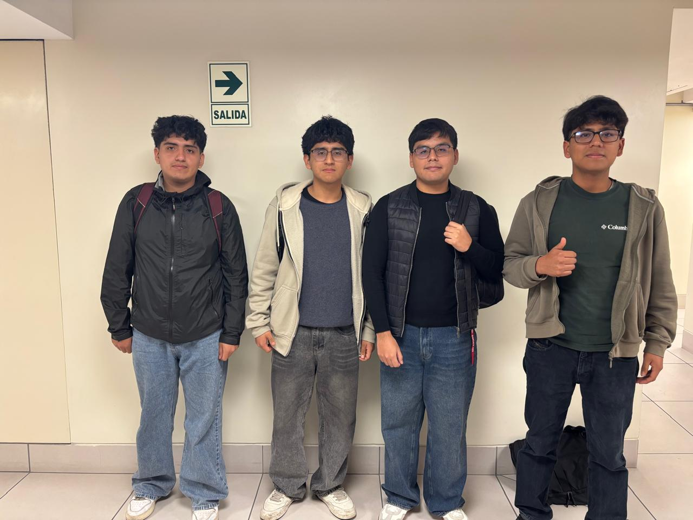

# Equipo 06 - Fundamentos de Diseño

### Carrera de Ingeniería Informática / Industrial

**Universidad Peruana Cayetano Heredia**

\---

## 🌍 Descripción del Equipo

Somos el **Equipo 06** del curso **Nombre del curso 2026-2**, conformado por estudiantes de la carrera de Ingeniería Informática / Industrial.  
Nuestro objetivo es aplicar la metodología de diseño para generar soluciones innovadoras con impacto social, tecnológico y ambiental.

Nos interesa trabajar en los siguientes **Objetivos de Desarrollo Sostenible (ODS):**

* 

\---

## 📸 Fotografía del Equipo

  <em>Figura 1. Fotografía del equipo 06</em>

\---

## 👥 Integrantes del Equipo

|Foto|Nombre|Rol|Intereses|
|-|-|-|-|
||**Kevin Canchari Condori**|Líder del equipo|Me gustan los procesos Industriales y la Ciencia de Datos|
||**Nombre 2**|Responsable de investigación|Gestión ambiental, desarrollo comunitario|
||**Mickele Carlos Torres Velazco**|Diseñador/a|Diseño de prototipos, programar|
||**Paul Nole Pazos**|Encargado/a de documentación|Me gustan los videojuegos y programar|
||**Fabio Calcina Flores**|Programador/a - Modelador/a|Me gusta programar en Python y resolver problemas|

\---

## 📌 Resumen Final

Este README resume quiénes somos, qué nos motiva y en qué ODS queremos enfocar nuestro trabajo durante el curso.

